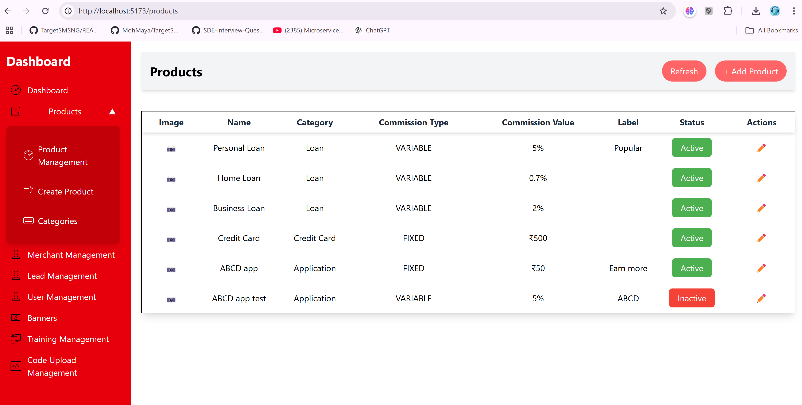

## Features
- View a list of products in a table.
- Add a new product through a modal.
- Edit an existing product through a modal.
- Toggle product details with a collapsible sidebar.
- Responsive layout with Tailwind CSS for styling.

## Technologies Used
- React
- Vite
- Tailwind CSS
- Context API for state management

# Project File Structure

**FILE STRUCTURE**

### Explanation:

- `/public` contains the `index.html`, the entry point of the app.  
- `/src` contains all the source files for the application:  
  - `/components` has the UI components of the project.  
  - `/context` contains the `ProductContext.js` to manage global state.  
  - `App.js` is the main React component where the app is structured.  
  - `index.js` is the entry point for the React app.  
- `vite.config.js` is the configuration file for Vite.  
- `package.json` contains dependencies and scripts for the project.  
- `.gitignore` is used to specify files that should not be tracked by Git.  

